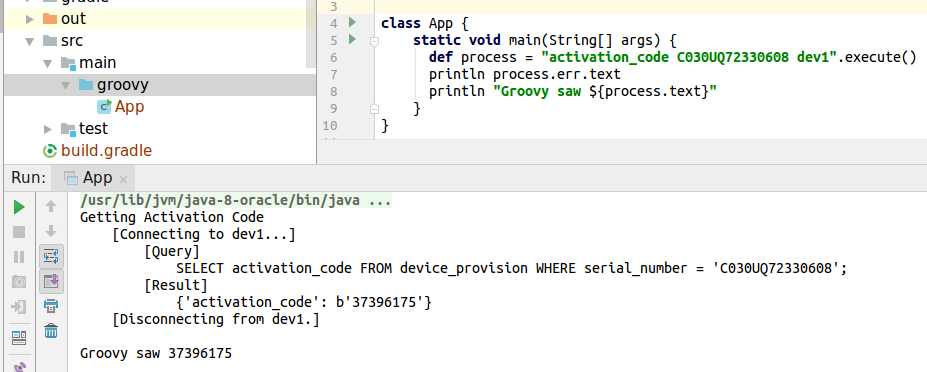

# Install to a virtual environment

Python virtual environments are a good way to keep this package's commands and dependencies from
cluttering up your system.  If you choose this kind of install, the scOOBE commands will not be
available unless you are in the appropriate virtual environment (which you will create).  This
especially useful while developing scOOBE itself--but some users may also appreciate the isolation
that venv's provide.

## The First Time

    # get the repo and enter its root
    ❯  git clone https://github.com/mattrixman/scOOBE && cd scOOBE

    # create a virtual environment (this makes a folder)
    ❯ python3 -m venv .venv

    # enter it (by sourcing the script in the newly created folder)
    ❯ source .venv/bin/activate

    # get the latest version of the package manager
    .venv ❯ pip installl --upgrade pip

    # add scoobe snacs to the virtual environment (also download dependencies)
    .venv ❯ python setup.py develop

    # plug in your device and do stuff with scoobe snacs
    .venv ❯ device_info
        {"marketing_name": "Mini", "code_name": "MAPLECUTTER", "serial": "C030UQ72330608", "targeting": "local:10.249.253.118", "cpuid": "00000001740e21801000000007018640"}

    # exit the venv
    .venv ❯ deactivate

    # note that the scoobe snacs aren't avaliable
    ❯ device_info
        command not found: device_info

## Subsequent Times:

    # activate the venv
    ❯ source .venv/bin/activate

    # do stuff
    .venv ❯ device_info | jq .targeting
        "local:10.249.253.118"

    # exit the venv
    .venv ❯ deactivate

## With an IDE

To use scoobe snacs from an IDE, enter the virtual environment and launch your IDE from there:

    ❯ source .venv/bin/activate
    .venv ❯ idea /path/to/project

From there, you can invoke a snac like you would any other command.

Notice that the status messages are written to STERR, but the requested data is written to STDOUT.  This makes it easy to get what you asked for, while still knowing what went down.
